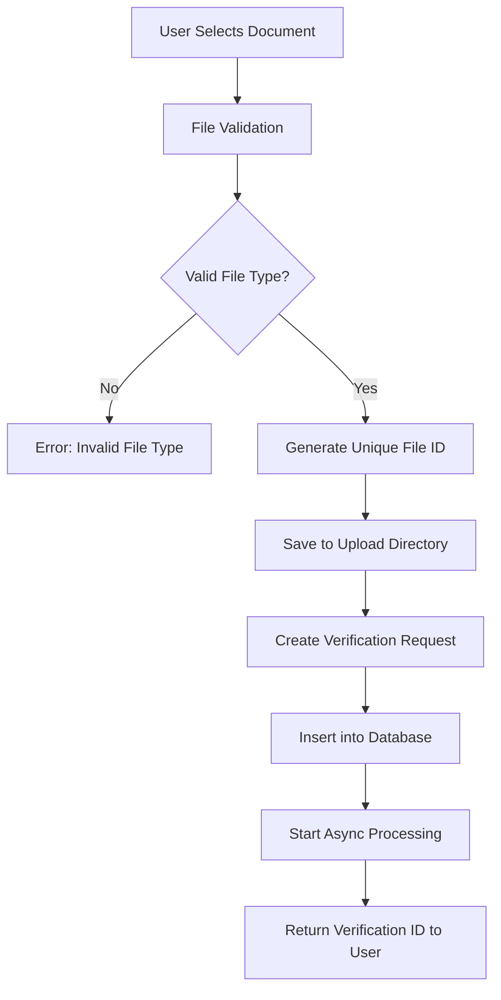
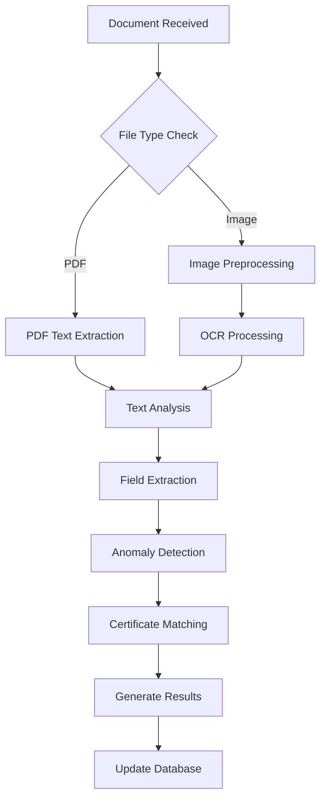
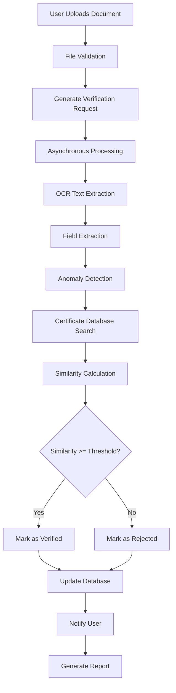
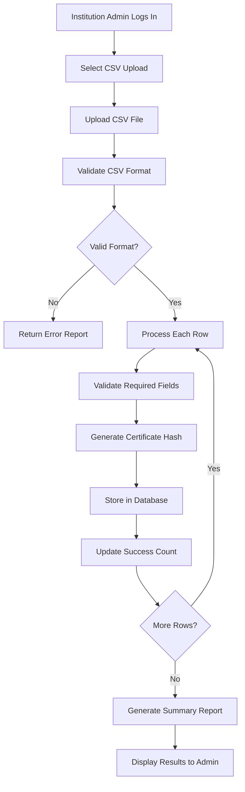
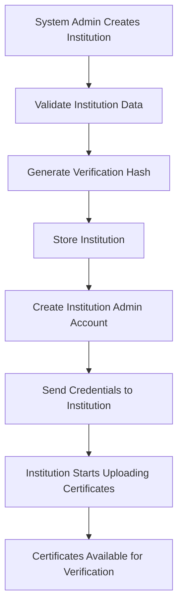

# Document Verification System - Comprehensive Documentation

## Table of Contents
1. [System Overview](#system-overview)
2. [User Roles and Permissions](#user-roles-and-permissions)
3. [Technical Architecture](#technical-architecture)
4. [Document Upload and Processing Flow](#document-upload-and-processing-flow)
5. [OCR Processing Pipeline](#ocr-processing-pipeline)
6. [Verification and Matching Algorithm](#verification-and-matching-algorithm)
7. [Hash-Based Security System](#hash-based-security-system)
8. [Anomaly Detection System](#anomaly-detection-system)
9. [API Endpoints](#api-endpoints)
10. [Database Schema](#database-schema)
11. [Frontend User Interfaces](#frontend-user-interfaces)
12. [Security Considerations](#security-considerations)
13. [System Workflows](#system-workflows)

## System Overview

The **Fake Degree/Certificate Recognition System** is a comprehensive document verification platform built alongside an existing attendance management system. It leverages advanced OCR technology, machine learning algorithms, and hash-based verification to detect fake or manipulated academic certificates and degrees.

### Key Features
- **Free OCR Processing**: Uses Tesseract, PyPDF2, and pdfplumber for text extraction
- **Multi-format Support**: Handles PDF, JPG, PNG, JPEG, TIFF, and BMP files
- **Role-based Access Control**: Five distinct user roles with specific permissions
- **Hash-based Verification**: Cryptographic verification of certificate authenticity
- **Anomaly Detection**: AI-powered detection of suspicious patterns
- **Bulk Certificate Management**: CSV upload for institutions
- **Real-time Processing**: Asynchronous document processing with status tracking

## User Roles and Permissions

### 1. Verifier
**Purpose**: Document verification specialists who process certificate verification requests

**Capabilities**:
- Upload documents (PDF, images) for verification
- View verification status and results
- Access verification history
- Specify requester organization
- View confidence scores and anomaly reports

**Interface Features**:
- Document upload with drag-and-drop functionality
- Real-time processing status updates
- Comprehensive verification results display
- Verification history tracking

**API Access**:
- `POST /api/certificates/upload` - Upload documents for verification
- `GET /api/certificates/verify/{verification_id}` - Check verification status

### 2. Institution Admin
**Purpose**: Manage certificates for their specific educational institution

**Capabilities**:
- Bulk upload certificates via CSV files
- Manage institution's certificate database
- View certificates issued by their institution
- Access to institution-specific analytics

**Restrictions**:
- Can only manage certificates for their assigned institution
- Cannot access other institutions' data
- Cannot create new institutions

**Interface Features**:
- CSV template download and upload
- Bulk processing status with error reports
- Certificate database management
- Upload validation with detailed error reporting

**API Access**:
- `POST /api/institutions/{institution_id}/certificates/upload` - Bulk CSV upload
- Institution-specific certificate management endpoints

### 3. System Admin
**Purpose**: Complete system administration and oversight

**Capabilities**:
- Create and manage institutions
- Full access to all certificates and verification requests
- System-wide analytics and reporting
- User management (implied functionality)
- Institution verification and approval

**Interface Features**:
- Institution creation and management
- System-wide dashboard
- Comprehensive reporting tools
- User management interface

**API Access**:
- `POST /api/institutions` - Create new institutions
- `GET /api/institutions` - List all institutions
- Full access to all system endpoints

### 4. Existing Roles (Enhanced)
**Student, Teacher, Principal**: Retain original attendance system functionality with potential access to verification features based on institutional needs.

## Technical Architecture

### Backend Stack
- **Framework**: FastAPI (Python)
- **Database**: MongoDB with AsyncIOMotorClient
- **OCR Libraries**: 
  - Tesseract-OCR for image processing
  - PyPDF2 and pdfplumber for PDF text extraction
  - OpenCV for image preprocessing
- **Security**: JWT authentication, bcrypt password hashing
- **File Processing**: PIL, NumPy for advanced image processing

### Frontend Stack
- **Framework**: React.js
- **UI Components**: Custom components with Tailwind CSS
- **File Upload**: Native HTML5 with drag-and-drop
- **State Management**: React hooks and local state

### Infrastructure
- **File Storage**: Local filesystem with organized directory structure
- **Processing**: Asynchronous document processing
- **API**: RESTful API with comprehensive error handling

## Document Upload and Processing Flow

### 1. Document Upload Process


**Supported File Types**: PDF, JPG, JPEG, PNG, TIFF, BMP

**File Size Limits**: Configurable (recommended max 10MB)

**File Naming**: UUID-based naming to prevent conflicts

### 2. Processing Pipeline


## OCR Processing Pipeline

### Image Preprocessing
1. **Image Loading**: Supports multiple formats with fallback mechanisms
2. **Grayscale Conversion**: Convert to grayscale for better OCR accuracy
3. **Noise Reduction**: Apply `cv2.fastNlMeansDenoising()` to remove noise
4. **Adaptive Thresholding**: Use `cv2.adaptiveThreshold()` for better text segmentation
5. **Quality Enhancement**: Optimize for Tesseract processing

### Text Extraction Methods

#### For Images:
```python
def extract_text_from_image(image_path: str) -> Dict[str, Any]:
    # Preprocessing pipeline
    processed_img = preprocess_image(image_path)
    
    # OCR with confidence scoring
    text = pytesseract.image_to_string(processed_img)
    confidence_data = pytesseract.image_to_data(image, output_type=pytesseract.Output.DICT)
    
    # Calculate average confidence
    avg_confidence = calculate_confidence(confidence_data)
    
    return {
        "text": text,
        "confidence": avg_confidence,
        "method": "tesseract_ocr"
    }
```

#### For PDFs:
```python
def extract_text_from_pdf(pdf_path: str) -> Dict[str, Any]:
    # Primary: pdfplumber (better for complex layouts)
    with pdfplumber.open(pdf_path) as pdf:
        text = extract_all_pages(pdf)
    
    # Fallback: PyPDF2 if pdfplumber fails
    if not text:
        text = extract_with_pypdf2(pdf_path)
    
    return {
        "text": text,
        "confidence": 95.0,  # PDF extraction is reliable
        "method": "pdf_extraction"
    }
```

### Field Extraction Patterns
The system uses sophisticated regex patterns to extract structured data:

```python
patterns = {
    "name": [
        r"(?:name|student|candidate)[:.]?\s*([A-Z][a-z]+(?:\s+[A-Z][a-z]+)*)",
        r"(?:this is to certify that)\s+([A-Z][a-z]+(?:\s+[A-Z][a-z]+)*)"
    ],
    "roll_number": [
        r"(?:roll|roll no|enrollment)[:.]?\s*([A-Z0-9]+)",
    ],
    "course": [
        r"(?:course|degree|diploma)[:.]?\s*([A-Za-z\s&]+)",
    ],
    "year": [
        r"(?:year|passed|passing)[:.]?\s*(\d{4})",
    ],
    "grade": [
        r"(?:grade|class|division)[:.]?\s*([A-Z\+\-]+)",
    ]
}
```

## Verification and Matching Algorithm

### Certificate Matching Process
1. **Query Building**: Construct MongoDB queries based on extracted fields
2. **Fuzzy Matching**: Use textdistance library for approximate string matching
3. **Weighted Scoring**: Calculate similarity scores with field-specific weights
4. **Threshold Validation**: Apply configurable threshold (default: 0.7) for authenticity

### Similarity Scoring Algorithm
```python
def calculate_similarity_score(extracted_data, certificate):
    scores = []
    
    # Name matching (30% weight)
    if "name" in extracted_data:
        name_similarity = textdistance.jaro_winkler(
            extracted_data["name"].lower(),
            certificate["student_name"].lower()
        )
        scores.append(name_similarity * 0.3)
    
    # Roll number exact match (25% weight)
    if "roll_number" in extracted_data:
        if extracted_data["roll_number"] == certificate["roll_number"]:
            scores.append(0.25)
    
    # Course similarity (20% weight)
    if "course" in extracted_data:
        course_similarity = textdistance.jaro_winkler(
            extracted_data["course"].lower(),
            certificate["course_name"].lower()
        )
        scores.append(course_similarity * 0.2)
    
    # Year exact match (25% weight)
    if "year" in extracted_data:
        if int(extracted_data["year"]) == certificate["passing_year"]:
            scores.append(0.25)
    
    return sum(scores)
```

### Authenticity Determination
- **Authentic**: Similarity score ≥ 0.7 (70%)
- **Rejected**: Similarity score < 0.7
- **Failed**: Processing errors or insufficient data

## Hash-Based Security System

### Certificate Hash Generation
```python
def generate_certificate_hash(certificate_data: Dict[str, Any]) -> str:
    # Create canonical string representation
    keys = sorted(certificate_data.keys())
    canonical_string = ""
    
    for key in keys:
        if certificate_data[key] is not None:
            canonical_string += f"{key}:{str(certificate_data[key])}"
    
    # Generate SHA-256 hash
    return hashlib.sha256(canonical_string.encode()).hexdigest()
```

### Hash Verification Process
1. **Certificate Storage**: Generate hash during certificate creation
2. **Verification**: Recreate hash from extracted data
3. **Comparison**: Match against stored hashes in database
4. **Integrity Check**: Detect any data tampering or modification

## Anomaly Detection System

### Suspicious Pattern Detection
```python
def detect_anomalies(text: str, extracted_fields: Dict) -> List[str]:
    anomalies = []
    
    # Text-based anomalies
    suspicious_patterns = [
        r"photoshop", r"edit", r"modified", r"fake", r"duplicate"
    ]
    
    for pattern in suspicious_patterns:
        if re.search(pattern, text.lower()):
            anomalies.append(f"Suspicious text detected: {pattern}")
    
    # Character density analysis
    if len(re.findall(r'[^\w\s]', text)) > len(text) * 0.1:
        anomalies.append("Unusual character density detected")
    
    # Font consistency check
    if len(set(text)) / len(text) > 0.3:
        anomalies.append("Possible mixed font usage detected")
    
    return anomalies
```

### Data Validation Anomalies
- **Invalid Years**: Before 1950 or future years
- **Impossible Percentages**: Below 0% or above 100%
- **Format Inconsistencies**: Unusual formatting patterns
- **Character Anomalies**: Excessive special characters

## API Endpoints

### Certificate Verification
```
POST /api/certificates/upload
- Description: Upload document for verification
- Auth: Required (any authenticated user)
- Parameters: file (multipart), requester_organization (optional)
- Returns: verification_id, status message

GET /api/certificates/verify/{verification_id}
- Description: Get verification status and results
- Auth: Required (requester or admin roles)
- Returns: Complete verification results with confidence scores
```

### Institution Management
```
POST /api/institutions
- Description: Create new institution
- Auth: system_admin only
- Parameters: Institution details (name, code, type, etc.)
- Returns: institution_id, verification_hash

GET /api/institutions
- Description: List all institutions
- Auth: Required
- Returns: List of institutions with basic info

POST /api/institutions/{institution_id}/certificates/upload
- Description: Bulk upload certificates via CSV
- Auth: institution_admin (same institution) or system_admin
- Parameters: CSV file
- Returns: Upload summary with success/error counts
```

## Database Schema

### Collections

#### Users
```javascript
{
  id: "uuid",
  username: "string",
  password_hash: "string",
  role: "student|teacher|principal|verifier|institution_admin|system_admin",
  student_id: "string|null",
  class_section: "A5|A6|null",
  subjects: ["string"]|null,
  institution_id: "string|null",  // For institution_admin
  full_name: "string",
  created_at: "datetime"
}
```

#### Institutions
```javascript
{
  id: "uuid",
  name: "string",
  code: "string",  // Unique identifier
  type: "university|college|institute",
  state: "string",
  city: "string",
  established_year: "number",
  accreditation: "string|null",
  contact_email: "string",
  contact_phone: "string",
  website: "string|null",
  is_verified: "boolean",
  verification_hash: "string",  // SHA-256 hash
  created_at: "datetime",
  updated_at: "datetime"
}
```

#### Certificates
```javascript
{
  id: "uuid",
  certificate_id: "string",  // From institution
  student_name: "string",
  father_name: "string|null",
  roll_number: "string",
  registration_number: "string",
  course_name: "string",
  course_type: "degree|diploma|certificate",
  course_duration: "string",
  passing_year: "number",
  grade: "string",
  percentage: "number|null",
  cgpa: "number|null",
  institution_id: "string",
  institution_name: "string",
  issued_date: "datetime",
  certificate_hash: "string",  // SHA-256 hash
  metadata: "object",  // Additional details
  is_verified: "boolean",
  created_at: "datetime"
}
```

#### Verification Requests
```javascript
{
  id: "uuid",
  requester_id: "string",
  requester_name: "string",
  requester_organization: "string|null",
  file_path: "string",
  file_type: "string",
  file_size: "number",
  ocr_text: "string|null",
  extracted_data: "object",  // Structured fields
  verification_status: "pending|processing|verified|rejected|failed",
  confidence_score: "number|null",
  matched_certificate_id: "string|null",
  anomalies_detected: ["string"],
  verification_notes: "string|null",
  processed_by: "string|null",
  created_at: "datetime",
  processed_at: "datetime|null"
}
```

## Frontend User Interfaces

### Verifier Dashboard
- **Document Upload**: Drag-and-drop interface with file validation
- **Verification History**: List of all verification requests with status
- **Results Display**: Detailed verification results with confidence scores
- **Anomaly Reports**: Visual representation of detected anomalies

### Institution Admin Dashboard
- **Certificate Management**: View and manage institution certificates
- **CSV Upload**: Bulk certificate upload with template and validation
- **Error Reporting**: Detailed error reports for failed uploads
- **Analytics**: Institution-specific verification statistics

### System Admin Dashboard
- **Institution Management**: Create and manage educational institutions
- **User Management**: Comprehensive user administration
- **System Reports**: Global analytics and verification statistics
- **Configuration**: System-wide settings and parameters

## Security Considerations

### Authentication & Authorization
- **JWT Tokens**: Secure token-based authentication
- **Role-based Access**: Strict role-based access control
- **Password Security**: bcrypt hashing with salt

### Data Protection
- **File Security**: Secure file storage with UUID naming
- **Hash Verification**: Cryptographic verification of certificates
- **Input Validation**: Comprehensive input sanitization
- **SQL Injection Prevention**: MongoDB with parameterized queries

### Privacy & Compliance
- **Data Minimization**: Store only necessary information
- **Access Logging**: Track all verification requests
- **Secure Deletion**: Proper file cleanup procedures
- **GDPR Compliance**: User data protection measures

## System Workflows

### Complete Document Verification Workflow



### Institution Certificate Management Workflow



### System Administration Workflow



## Performance Considerations

### Optimization Strategies
- **Asynchronous Processing**: Non-blocking document processing
- **Database Indexing**: Optimized queries for certificate matching
- **Caching**: Result caching for repeated verification requests
- **File Management**: Automatic cleanup of processed files
- **Load Balancing**: Distributed processing for high volumes

### Scalability Features
- **Horizontal Scaling**: Microservice-ready architecture
- **Database Sharding**: Support for large certificate databases
- **CDN Integration**: Efficient file delivery
- **API Rate Limiting**: Prevent abuse and ensure fair usage

## Conclusion

The Document Verification System provides a comprehensive, secure, and scalable solution for detecting fake academic certificates. With its advanced OCR capabilities, sophisticated matching algorithms, and robust security measures, it serves as a reliable tool for educational institutions, employers, and verification agencies to combat document fraud and maintain the integrity of academic credentials.

The system's modular design allows for easy expansion and integration with existing systems, while its role-based architecture ensures appropriate access control and data security. The combination of automated processing and human oversight provides the optimal balance between efficiency and accuracy in document verification.